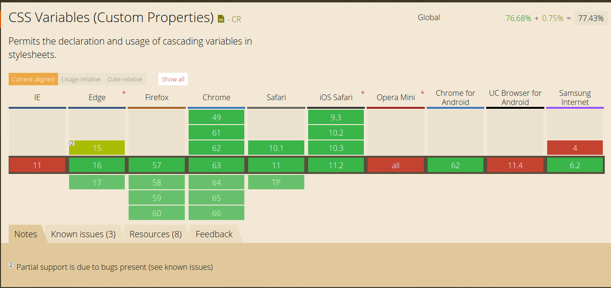

# theme-it :wrench: :rainbow:
[](#contributors)
[](https://www.npmjs.com/package/theme-it)
[](https://github.com/mmckeaveney/theme-it/blob/master/LICENSE)


A small (5.5kb minified), blazing fast theming library powered by CSS custom properties (also known as CSS4 Variables) with absolutely zero dependencies.

- [theme-it](#theme-it)
    - [Rationale](#rationale)
    - [Installation](#installation)
    - [Basic Usage](#basic-usage)
        - [Check if your browser supports CSS custom properties and theme-it](#check-if-your-browser-supports-css-custom-properties-and-theme-it)
        - [Manage themes and properties using theme-it](#manage-themes-and-properties-using-theme-it)
        - [Perform a callback when you execute a theme-it operation](#perform-a-callback-when-you-execute-a-theme-it-operation)
    - [Advanced Usage](#advanced-usage)
        - [Create a completely new theme at runtime, and apply it](#create-a-completely-new-theme-at-runtime-and-apply-it)
    - [Examples](#examples)
    - [API](#api)
        - [The Themeit object](#the-themeit-object)
        - [Configuration options](#configuration-options)
            - [debug](#debug)
            - [themeClasses](#themeclasses)
        - [Callbacks](#callbacks)
            - [onPropertyGet](#onpropertyget)
            - [onPropertySet](#onpropertyset)
            - [onPropertyRemove](#onpropertyremove)
            - [onThemesCreate](#onthemescreate)
            - [onThemeApply](#onthemeapply)
            - [onThemeUnapply](#onthemeunapply)
    - [Command Line Interface](#command-line-interface)
    - [Development](#development)
    - [Known Issues](#known-issues)
    - [Contributors](#contributors)

## Rationale
Variables are one of the reasons [CSS preprocessors](https://developer.mozilla.org/en-US/docs/Glossary/CSS_preprocessor) ([SASS](http://sass-lang.com/), [LESS](http://lesscss.org/)) exist at all. The limitation here is that preprocessors provide variable functionality at **compile time**. This means you cannot access these variables at runtime when you compile code from your chosen preprocessor into CSS. This poses a problem that many developers solve by bundling a different stylesheet for every theme and switching between them with JavaScript.

Native [CSS custom properties](https://developer.mozilla.org/en-US/docs/Web/CSS/Using_CSS_variables) were introduced to allow you to work with variables directly, change them at runtime with JS and DRY up CSS definitions out of the box. theme-it is a small, fast library that provides a bunch of utilities and abstractions for working with CSS variables at runtime, allowing you to dynamically theme your applications at the root or even component level regardless of framework, and without a CSS preprocessor or any other dependencies at all.

**theme-it** allows you to:
- Manage CSS Variable themes at runtime (apply and unapply themes)
- Get and set individual CSS variables at runtime
- Add callbacks for all theming operations so you can update client state, post to the server and more.
- Convert your current CSS in JS theme configuration to use CSS variables
- Genrerate completely new theme CSS using the CLI, or create them in the browser to enable totally custom, user created colour schemes at runtime.


## Installation
**npm**
```
npm i theme-it
```

**yarn**
```
yarn add theme-it
```

## Basic Usage
There are many different ways to use theme-it in your application. The easiest way is to create your own theme classes in your CSS, and manage the classnames using theme-it. theme-it has a class based API, so you need to instantiate the `Themeit` object in order to use it.

The following is a simple example of a theme you can create in one of your CSS files. Each class contains CSS variables which cascade - meaning any children of the element with that class applied will inherit the theme variables.

```css
.dark-theme {
    --primary-color: black;
    --secondary-color: darkblue;
    --tertiary-color: darkgreen;
}

.light-theme {
    --primary-color: white;
    --secondary-color: skyblue;
    --tertiary-color: green;
}
```

### Check if your browser supports CSS custom properties and theme-it
`isSupported()` will return a boolean as to whether or not your browser supports CSS custom properties.

```js
const themeit = new Themeit();

if (themeit.isSupported()) {
    console.log("CSS custom properties supported. It's party time");
}
```

Current browser support for CSS variables (courtesy of [caniuse](http://caniuse.com)):



### Manage themes and properties using theme-it
You can manage themes as well as individual properties with theme-it. The following example shows you how to do this.

Every function that manages themes and properties in theme-it follows a convention. The last argument is always a selector, which defaults to `body` for application wide theming. You can however pass your own selector to theme at the component level.

Every update to a theme or property will trigger a re-render, which will apply your new theme or property instantly. Theme-it will also throw errors if you try to apply themes or remove properties that don't exist.

```js
// imports the minified production bundle.
// To import transpiled, non-minified code, import from the lib/ directory.
import Themeit from "theme-it";

const themeit = new Themeit({
    themeClasses: ["light-theme", "dark-theme"]
});

// apply a theme
themeit.applyTheme("dark-theme");

// get the value of a CSS property
const darkThemePrimaryColor = themeit.getProperty("primary-color"); // black

// set the value of a CSS property
themeit.setProperty("primary-color", "purple");

// remove a CSS property completely
themeit.removeProperty("primary-color");

// apply a different theme (this replaces the theme already on the element)
themeit.applyTheme("light-theme");

// unapply the theme
themeit.unapplyTheme("light-theme");

// apply a theme to a certain element and its children
themeit.applyTheme("dark-theme", ".my-cool-element")
```

### Perform a callback when you execute a theme-it operation  
theme-it allows you to provide optional callbacks when you instantiate the `Themeit` object. This allows you to perform an action when you apply, unapply or create a theme. You can also provide callbacks for getting, setting and removing properties.

This is especially useful when you want to keep track of the current theme in your client state, or perform a call to the server with the updated theme information.

Refer to the API for the details on each callback and its arguments.

```js
const themeit = new Themeit({
    themeClasses: ["dark-theme", "light-theme"],
    onPropertyGet: console.log,
    onPropertySet: console.log,
    onPropertyRemove: console.log,
    onThemesCreate: console.log,
    onThemeApply: console.log,
    onThemeUnapply: console.log
});

themeit.applyTheme("dark-theme") // onThemeApply will be executed
themeit.unapplyTheme("dark-theme") // onThemeUnapply will be executed
themeit.setProperty("primary-color", "red") // onPropertySet will be executed
themeit.getProperty("primary-color") // onPropertyGet will be executed
themeit.removeProperty("primary-color") // onPropertyRemove will be executed
themeit.createThemes({
    "new-theme": {
        primaryColor: "blue"
    }
}); // onThemesCreate will be executed
```

## Advanced Usage

### Create a completely new theme at runtime, and apply it
You can create new themes at runtime with theme-it and apply them. You pass in a theme configuration object similar to what you would use in CSS in JS libraries, which theme-it will transform into valid CSS definitions using CSS variables. These CSS definitions will be injected into the `<head />` tag of the document. Be aware that refreshing the page means you will lose your theme.

A solution to this is to use the `onThemesCreate` callback to save your theme somewhere so you can use it again.  

Note that when the theme config is parsed, it will flatten the object structure into a CSS class definition, changing the theme names and variables from camel to kebab-case. For example, when you perform the following:

```js
themeit.createThemes({
    coolTheme: {
        primaryColor: "blue"
    }
});

```

The theme object will be transformed into the following and injected into the `head` tag.

```css
.cool-theme {
    --primary-color: blue;
}
```

You can also nest properties, and theme-it will flatten them out for you -

```js
themeit.createThemes({
  nestedDarkTheme: {
    primaryColor: "black",
    secondaryColor: "papayawhip",
    globalBorder: "2px",
    button: {
      primaryColor: "blue"
    },
    input: {
      secondaryColor: "papayawhip",
      radio: {
        color: "purple"
      },
      text: {
        border: "5px"
      }
    }
  }
});

```

The generated CSS for the above theme will look like this -

```css
  .nested-dark-theme {
    --primary-color: black;
    --secondary-color: papayawhip;
    --global-border: 2px;
    --button-primary-color: blue;
    --input-secondary-color: papayawhip;
    --input-radio-color: purple;
    --input-text-border: 5px
  }
```

If you find a theme you like and want to add it to your CSS so you don't have to generate it every time, you can run theme-it with the `debug` flag, which will output the generated CSS to the console when you create a theme. You can then copy this CSS into your own code and add the class name to theme-its `themeClasses` array so you can manage it.

You can also do this without running theme-it in the browser by using the [Command Line Interface](#command-line-interface).

Some other examples to show how you can create a theme, and apply it after creation -

```js
const themeit = new Themeit();

// Create some new themes
themeit.createThemes({
    coolNewTheme: {
        primaryColor: "papayawhip",
        secondaryColor: "palevioletred",
        tertiaryColor: "purple",
    },
    otherCoolNewTheme: {
        primaryColor: "white",
        secondaryColor: "white",
        tertiaryColor: "white",
    }
});

// apply the first theme
themeit.applyTheme("cool-new-theme");

// apply the second theme
themeit.applyTheme("other-cool-new-theme");

// Nested theme
themeit.createThemes({
  nestedDarkTheme: {
    primaryColor: "black",
    secondaryColor: "papayawhip",
    globalBorder: "2px",
    button: {
      primaryColor: "blue"
    },
    input: {
      secondaryColor: "papayawhip",
      radio: {
        color: "purple"
      },
      text: {
        border: "5px"
      }
    }
  },
  nestedLightTheme: {
    primaryColor: "gray",
    secondaryColor: "purple",
    globalBorder: "2px",
    button: {
      primaryColor: "blue"
    },
    input: {
      secondaryColor: "papayawhip",
      radio: {
        color: "purple"
      },
      text: {
        border: "5px"
      }
    }
  }
})

themeit.applyTheme("nested-light-theme");
```

## Examples
As a way of show casing the power of Themeit we created some examples in different frameworks.
The examples are just a showcase. Themeit doesn't, in any way, depend on the frameworks listed below.
 - [Vue](https://codesandbox.io/s/zz2on366jl?view=preview)

## API

### The Themeit object
This is the main object you need to instantiate in order to use themeit. You can do so as follows:

```js
import Themeit from "theme-it";

const themeit = new Themeit();
```

### Configuration options
The `Themeit` constructor takes a configuration object. Below are all the available options.

#### debug
`Boolean`

default: `false`

When `debug` is true, extra logging and information will be logged to the console when you perform certain theme-it operations. This is useful for development.

```js
new Themeit({ debug: true });
```


#### themeClasses
`Array<String>`

default: `[]`

The list of class names for themes you have already created in your CSS. This is required so theme-it knows which themes already exist, as well as for theme management. Make sure to keep this updated when you create a new theme in your CSS. When creating runtime themes with `createThemes`, theme-it will automatically update this array with the new theme name.

```css
.cool-theme {
    --primary-color: yellow;
}
```

```js
new Themeit({
    themeClasses: ["cool-theme"]
})
```

### Callbacks

#### onPropertyGet
Callback executed after `getProperty` is run.

**Type definition**

`(property: string, value: string, element: DOMNode) => any`

default: `undefined`

**property**: the name of the property you asked for (ie: `"primary-color"`)

**value**: the value of the property you asked for (ie: `"blue"`)

**element**: the DOM element you accessed the property on.

```js
new Themeit({
    onPropertyGet: (property, value, element) => console.log(property, value, element)
}).getProperty("primary-color");

// primary-color, blue, <body>...</body>
```


#### onPropertySet
Callback executed after `setProperty` is run.

**Type definition**

`(property: string, value: string, element: DOMNode) => any`

default: `undefined`

**property**: the name of the property you set (ie: `"primary-color"`)

**value**: the value you set  (ie: `"blue"`)

**element**: the DOM element you set the property on.

```js
new Themeit({
    onPropertySet: (property, value, element) => console.log(property, value, element)
}).setProperty("primary-color", "red");

// primary-color, blue, <body>...</body>
```


#### onPropertyRemove
Callback executed after `removeProperty` is run.

**Type definition**

`(property: string, value: string, element: DOMNode) => any`

default: `undefined`

**property**: the name of the property you removed (ie: `"primary-color"`)

**value**: the value of the property you removed (ie: `"blue"`)

**element**: the DOM element you remove the property from.

```js
new Themeit({
    onPropertyRemove: (property, value, element) => console.log(property, value, element)
}).removeProperty("primary-color");

// primary-color, blue, <body>...</body>
```

#### onThemesCreate
Callback executed after `createThemes` is run.

**Type definition**

`(themeNames: Array<String>, generatedThemeCSS: string) => any`

default: `undefined`

**themeNames**: The kebab-case names of the themes you generated.

**generatedThemeCSS**: The CSS generated by the new theme as a string.

```js
new Themeit({
    onThemesCreate: (themeName, css) => console.log(themeName, css);
}).createThemes({
    myTheme: {
        primaryColor: "purple"
    }
});

// ["my-theme"]
`
.my-theme {
    --primary-color: purple
}
`
```

#### onThemeApply
Callback executed after `applyTheme` is run.

**Type definition**

`(themeName: string, element: DOMNode) => any`

default: `undefined`

**themeName**: the name of the theme you applied (ie: `"some-theme"`)

**element**: the DOM element you applied the theme to.

```js
new Themeit({
    themeClasses: ["my-theme"],
    onThemeApply: (themeName, element) => console.log(themeName, element);
}).applyTheme("my-theme");

// "my-theme", <body> ... </body>
```


#### onThemeUnapply
Callback executed after `unapplyTheme` is run.

**Type definition**

`(themeName: string, element: DOMNode) => any`

default: `undefined`

**themeName**: the name of the theme you unapplied (ie: `"some-theme"`)

**element**: the DOM element you unapplied the theme from.

```js
new Themeit({
    themeClasses: ["my-theme"],
    onThemeApply: (themeName, element) => console.log(themeName, element);
}).unapplyTheme("my-theme");

// "my-theme", <body> ... </body>
```

## Command Line Interface
The CLI converts a JSON file with your theme configuration into a valid CSS file, which you can then use in your application by adding the classname to the `themeClasses` array. This saves you running theme-it in the browser to do the conversion.

theme-config.json
```json
{
    "primaryTheme": {
        "primaryColor": "red"
    }
}
```

```
theme-it theme-config.json my-theme.css
```

my-theme.css
```css
.primary-theme {
    --primary-color: red
}

```

## Development

Clone the repo and install dependencies with your favourite package manager. The NPM scripts in the `package.json` are below.

* `build:minified` => builds and minifies the code and outputs a production ready bundle
* `clean` => blows away build folders (`lib`, `dist`) for a clean build
* `dev` => runs a `parcel` development server with hot reloading for development. Access the development playground at `localhost:1234`  
* `prepublish` => runs `prepublish:compile` when executing a `npm publish`
* `prepublish:compile` => run `clean`, `transpile` and then `build:minified`
* `test` => runs the jest test suite.
* `test:watch` => run `test` in `watch` mode, which will re-run when you change files pertaining to your tests.
* `test:update` => run `test`, but update outdated jest snapshots  
* `transpile` => transpile all files in `src` into the `lib` folder using babel
* `contributors:add` => add a contributor to the all-contributorsrc. For example: `npm run contributors:add -- yourusername`. You can then select your contributions.
* `contributors:generate` => generate the new allcontributors file before checking in.
* `contributors:check` => check that the all-contributorsrc reflects all the people who have actually contributed to the project on github.

## Known Issues
- theme-it does not currently work with Internet Explorer due to lack of support for CSS variables. See [this issue](https://github.com/mmckeaveney/theme-it/issues/5) if you know how to implement a polyfill for this. I'd love your input!
## Contributors

Thanks goes to these wonderful people ([emoji key](https://github.com/kentcdodds/all-contributors#emoji-key)):

<!-- ALL-CONTRIBUTORS-LIST:START - Do not remove or modify this section -->
<!-- prettier-ignore -->
| [<br /><sub><b>Martin McKeaveney</b></sub>](https://github.com/mmckeaveney)<br />[💻](https://github.com/mmckeaveney/theme-it/commits?author=mmckeaveney "Code") [📖](https://github.com/mmckeaveney/theme-it/commits?author=mmckeaveney "Documentation") [💡](#example-mmckeaveney "Examples") [🤔](#ideas-mmckeaveney "Ideas, Planning, & Feedback") [⚠️](https://github.com/mmckeaveney/theme-it/commits?author=mmckeaveney "Tests") | [<br /><sub><b>victoriasloan</b></sub>](https://github.com/victoriasloan)<br />[💻](https://github.com/mmckeaveney/theme-it/commits?author=victoriasloan "Code") [💡](#example-victoriasloan "Examples") | [<br /><sub><b>Johan</b></sub>](https://github.com/johman10)<br />[💻](https://github.com/mmckeaveney/theme-it/commits?author=johman10 "Code") |
| :---: | :---: | :---: |
<!-- ALL-CONTRIBUTORS-LIST:END -->

This project follows the [all-contributors](https://github.com/kentcdodds/all-contributors) specification. Contributions of any kind welcome!
